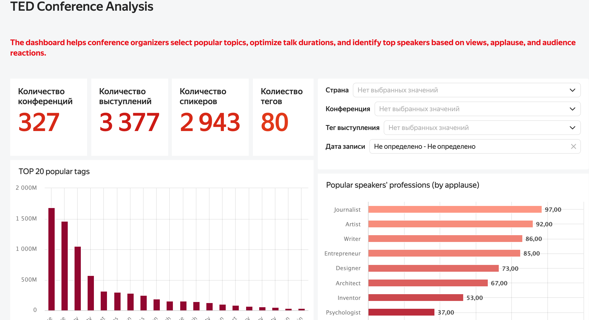
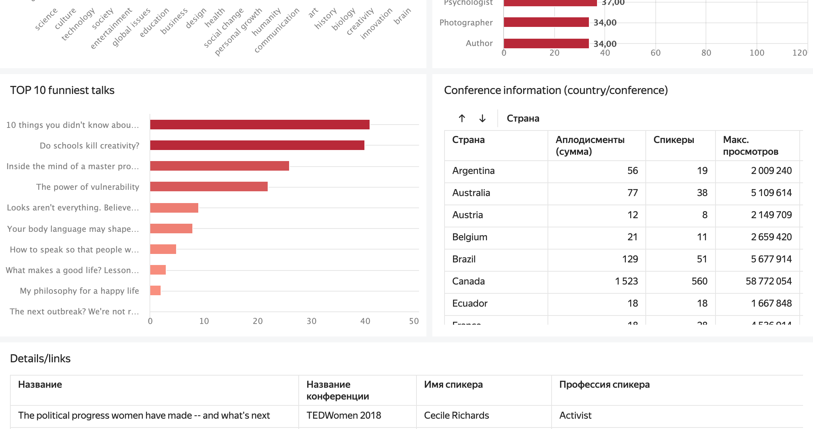

# TED Conferences Analytical Dashboard
A company licensed to organize TED conferences is preparing its first event. The goal was to design a memorable and engaging conference experience by understanding audience preferences, speaker impact, and session structure.
Yandex DataLens [TED Conferences Analytical Dashboard](https://datalens.ru/9sgo014i7akwu)

**Objective:**
Develop an interactive BI dashboard to analyze TED conference data for:
- Popular topics and audience reactions
- Average number of speakers per event
- Average talk duration and timing recommendations
- Identification of the most engaging speakers

**Implemented in the Dashboard:**

- General statistics: number of conferences, talks, speakers, and tags
- Conference-level details: average talk duration, maximum views, total applause, speaker count
- Talk analysis: top-10 funniest talks, top-20 popular tags
- Speaker insights: profession of most applauded speakers
- Interactive selectors: country, conference name, tags, recording date

**Tech Stack:**

- Yandex DataLens — data visualization and dashboard creation
- SQL — data preparation, joins, aggregations, subqueries
  
---

Provided actionable insights for planning future TED events based on audience preferences

